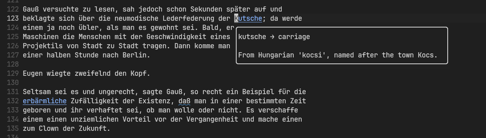

# ZehnTage

You have only ten days to learn German vocab? Then ZehnTage (10 days in German) is for you. It will show the word and some additional information, helpful for memorization, and automatically export it for Anki as tsv.



## Installation

LazyVim(recommended):

```lua
{
    "30be/zehntage",
    opts = {}, -- no opts are available.
    ft = { "markdown", "text" },
    keys = {
        { "K", "<cmd>ZehnTage<CR>", desc = "ZehnTage add word" }, -- the same as hinting is often set up
        { "<leader>zc", "<cmd>ZehnTageClear<CR>", desc = "ZehnTage clear word" },
    },
},
```

Then you need to set the environment variable ```GEMINI_API_KEY```, and it will just work.
The model used is gemini 2.5 flash lite, which is the fastest model that is intelligent enough for the task. And it's also basically free.

You can also just look at the source, its just [lua/zehntage.lua](lua/zehntage.lua).

The initial prompt is [included](PROMPT.md) (Claude Opus 4.6).

## Anki export

On the anki main screen, click 'import file', then select ```~/.local/share/nvim/zehntage_words.tsv```. Don't forget to use compatible card type!
